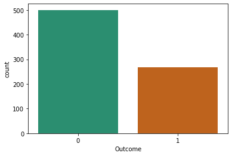

# Diabetes Classification Model with SVM

This dataset is originally from the National Institute of Diabetes and Digestive and Kidney Diseases. The objective of the dataset is to diagnostically predict whether or not a patient has diabetes, based on certain diagnostic measurements included in the dataset.

The data contains 8 independent variables and 1 dependent variable. The independent variables are: pregnancies, glucose, BMI, insulin, blood pressure, skin thickness, pedigree function, age The dependent variable: outcome


```python
#importing necessary libraries 
import pandas as pd
import numpy as np
import matplotlib.pyplot as plt
import seaborn as sns
%matplotlib inline
import warnings
warnings.filterwarnings('ignore')
```


```python
df = pd.read_excel('C:\\Users\\tcmculha\\Main_Notebook_Muge\\03-Pandas\\YOUTUBE\\DIABETS\\diabet_data.xlsx')
df.head(5)
```


<div>
<style scoped>
    .dataframe tbody tr th:only-of-type {
        vertical-align: middle;
    }

    .dataframe tbody tr th {
        vertical-align: top;
    }

    .dataframe thead th {
        text-align: right;
    }
</style>
<table border="1" class="dataframe">
  <thead>
    <tr style="text-align: right;">
      <th></th>
      <th>Pregnancies</th>
      <th>Glucose</th>
      <th>BloodPressure</th>
      <th>SkinThickness</th>
      <th>Insulin</th>
      <th>BMI</th>
      <th>DiabetesPedigreeFunction</th>
      <th>Age</th>
      <th>Outcome</th>
    </tr>
  </thead>
  <tbody>
    <tr>
      <th>0</th>
      <td>6</td>
      <td>148</td>
      <td>72</td>
      <td>35</td>
      <td>0</td>
      <td>33.6</td>
      <td>0.627</td>
      <td>50</td>
      <td>1</td>
    </tr>
    <tr>
      <th>1</th>
      <td>1</td>
      <td>85</td>
      <td>66</td>
      <td>29</td>
      <td>0</td>
      <td>26.6</td>
      <td>0.351</td>
      <td>31</td>
      <td>0</td>
    </tr>
    <tr>
      <th>2</th>
      <td>8</td>
      <td>183</td>
      <td>64</td>
      <td>0</td>
      <td>0</td>
      <td>23.3</td>
      <td>0.672</td>
      <td>32</td>
      <td>1</td>
    </tr>
    <tr>
      <th>3</th>
      <td>1</td>
      <td>89</td>
      <td>66</td>
      <td>23</td>
      <td>94</td>
      <td>28.1</td>
      <td>0.167</td>
      <td>21</td>
      <td>0</td>
    </tr>
    <tr>
      <th>4</th>
      <td>0</td>
      <td>137</td>
      <td>40</td>
      <td>35</td>
      <td>168</td>
      <td>43.1</td>
      <td>2.288</td>
      <td>33</td>
      <td>1</td>
    </tr>
  </tbody>
</table>
</div>


```python
df.dtypes
```


    Pregnancies                   int64
    Glucose                       int64
    BloodPressure                 int64
    SkinThickness                 int64
    Insulin                       int64
    BMI                         float64
    DiabetesPedigreeFunction    float64
    Age                           int64
    Outcome                       int64
    dtype: object


```python
df.isna().sum()
```


    Pregnancies                 0
    Glucose                     0
    BloodPressure               0
    SkinThickness               0
    Insulin                     0
    BMI                         0
    DiabetesPedigreeFunction    0
    Age                         0
    Outcome                     0
    dtype: int64


```python
df.describe()
```


<div>
<style scoped>
    .dataframe tbody tr th:only-of-type {
        vertical-align: middle;
    }

    .dataframe tbody tr th {
        vertical-align: top;
    }

    .dataframe thead th {
        text-align: right;
    }
</style>
<table border="1" class="dataframe">
  <thead>
    <tr style="text-align: right;">
      <th></th>
      <th>Pregnancies</th>
      <th>Glucose</th>
      <th>BloodPressure</th>
      <th>SkinThickness</th>
      <th>Insulin</th>
      <th>BMI</th>
      <th>DiabetesPedigreeFunction</th>
      <th>Age</th>
      <th>Outcome</th>
    </tr>
  </thead>
  <tbody>
    <tr>
      <th>count</th>
      <td>768.000000</td>
      <td>768.000000</td>
      <td>768.000000</td>
      <td>768.000000</td>
      <td>768.000000</td>
      <td>768.000000</td>
      <td>768.000000</td>
      <td>768.000000</td>
      <td>768.000000</td>
    </tr>
    <tr>
      <th>mean</th>
      <td>3.845052</td>
      <td>120.894531</td>
      <td>69.105469</td>
      <td>20.536458</td>
      <td>79.799479</td>
      <td>31.992578</td>
      <td>0.471876</td>
      <td>33.240885</td>
      <td>0.348958</td>
    </tr>
    <tr>
      <th>std</th>
      <td>3.369578</td>
      <td>31.972618</td>
      <td>19.355807</td>
      <td>15.952218</td>
      <td>115.244002</td>
      <td>7.884160</td>
      <td>0.331329</td>
      <td>11.760232</td>
      <td>0.476951</td>
    </tr>
    <tr>
      <th>min</th>
      <td>0.000000</td>
      <td>0.000000</td>
      <td>0.000000</td>
      <td>0.000000</td>
      <td>0.000000</td>
      <td>0.000000</td>
      <td>0.078000</td>
      <td>21.000000</td>
      <td>0.000000</td>
    </tr>
    <tr>
      <th>25%</th>
      <td>1.000000</td>
      <td>99.000000</td>
      <td>62.000000</td>
      <td>0.000000</td>
      <td>0.000000</td>
      <td>27.300000</td>
      <td>0.243750</td>
      <td>24.000000</td>
      <td>0.000000</td>
    </tr>
    <tr>
      <th>50%</th>
      <td>3.000000</td>
      <td>117.000000</td>
      <td>72.000000</td>
      <td>23.000000</td>
      <td>30.500000</td>
      <td>32.000000</td>
      <td>0.372500</td>
      <td>29.000000</td>
      <td>0.000000</td>
    </tr>
    <tr>
      <th>75%</th>
      <td>6.000000</td>
      <td>140.250000</td>
      <td>80.000000</td>
      <td>32.000000</td>
      <td>127.250000</td>
      <td>36.600000</td>
      <td>0.626250</td>
      <td>41.000000</td>
      <td>1.000000</td>
    </tr>
    <tr>
      <th>max</th>
      <td>17.000000</td>
      <td>199.000000</td>
      <td>122.000000</td>
      <td>99.000000</td>
      <td>846.000000</td>
      <td>67.100000</td>
      <td>2.420000</td>
      <td>81.000000</td>
      <td>1.000000</td>
    </tr>
  </tbody>
</table>
</div>


## Exploratory Data Analysis


```python
plt.figure(figsize=(6,4))
sns.countplot(data=df,x='Outcome',palette='Dark2')
```


    <matplotlib.axes._subplots.AxesSubplot at 0x269bc0d2040>





```python
fig, axes = plt.subplots(nrows = 2,ncols = 4,figsize = (20,6))
ax = sns.boxplot(y = "Pregnancies",data = df,ax = axes[0,0],)
ax = sns.boxplot(y = "Glucose",data = df,ax = axes[0,1])
ax = sns.boxplot(y = "BloodPressure",data = df,ax = axes[0,2])
ax = sns.boxplot(y = "SkinThickness",data = df,ax = axes[0,3])
ax = sns.boxplot(y = "Insulin",data = df,ax = axes[1,0])
ax = sns.boxplot(y = "BMI",data = df,ax = axes[1,1])
ax = sns.boxplot(y = "DiabetesPedigreeFunction",data = df,ax = axes[1,2])
ax = sns.boxplot(y = "Age",data = df,ax = axes[1,3])
```


```python
plt.figure(figsize = (25,10),dpi = 200)
sns.pairplot(df)
```


    <seaborn.axisgrid.PairGrid at 0x269b653fee0>


    <Figure size 5000x2000 with 0 Axes>


```python
def kdeplot_Diabetes(col,ax=None):

    ax = sns.kdeplot(df[col][(df["Outcome"] == 1) ],color="Red",ax=ax)
    ax = sns.kdeplot(df[col][(df["Outcome"] == 0) ],color="Blue",ax=ax)
    ax.legend(["Diabetes","Not Diabetes"],loc='upper right')
    ax.set_ylabel('Density')
    ax.set_xlabel(col)
    ax.set_title("Distribution of "+ col +" by Diabetes")
```


```python
fig, axes = plt.subplots(nrows = 2,ncols = 4,figsize = (22,12))
kdeplot_Diabetes("Pregnancies",ax=axes[0,0])
kdeplot_Diabetes("Glucose",ax=axes[0,1])
kdeplot_Diabetes("BloodPressure",ax=axes[0,2])
kdeplot_Diabetes("SkinThickness",ax=axes[0,3])
kdeplot_Diabetes("Insulin",ax=axes[1,0])
kdeplot_Diabetes("BMI",ax=axes[1,1])
kdeplot_Diabetes("DiabetesPedigreeFunction",ax=axes[1,2])
kdeplot_Diabetes("Age",ax=axes[1,3])
```


```python
plt.figure(figsize=(10,10))
plt.title('Pearson Correlation of Variables',y=1, size=15)
sns.heatmap(df.corr(),lw=0.1,vmax=0.1,square=True,linecolor='white',annot=True)
```


    <matplotlib.axes._subplots.AxesSubplot at 0x269bfb44280>


## Train-Test Split

train_test_split is a function in Sklearn model selection for splitting data arrays into two subsets: for training data and testing data. With this function, you don't need to divide the dataset manually.
By default, Sklearn train_test_split will make random partitions for the two subsets.


```python
from sklearn.model_selection import train_test_split
```


```python
X = df.drop('Outcome',axis=1)
y = df['Outcome']
X_train , X_test , y_train , y_test = train_test_split(X,y, test_size = 0.25, random_state = 0)
```

## Feature Scaling

Feature scaling is a method used to normalize the range of independent variables or features of data. 
In data processing, it is also known as data normalization and is generally performed during the data preprocessing step.


```python
from sklearn.preprocessing import StandardScaler
```


```python
sc_X = StandardScaler(with_mean=False)
```


```python
X_train = sc_X.fit_transform(X_train)
X_test = sc_X.transform(X_test)
```

## Calculate AUC score and plot ROC curve

The Receiver Operator Characteristic (ROC) curve is an evaluation metric for binary classification problems.
It is a probability curve that plots the TPR against FPR at various threshold values and essentially seperates the signal from the noise.
The Area Under the Curve (AUC) is the measure of the ability of a classifier to distinguish between classes and is used as a summary of the ROC curve. 


```python
from sklearn.metrics import roc_auc_score,roc_curve
```


```python
auc = roc_auc_score(y_test,y_pred)
print("AUC %0.3f" %auc)
```

    AUC 0.736
    


```python
fpr, tpr, thresholds = roc_curve(y_test,y_pred)
```


```python
plt.figure(figsize=(10,10))
plt.plot([0,1],[0,1],linestyle="--")
plt.plot(fpr,tpr, label='SVM (AUC = %0.2f)'% auc)
plt.xlabel("1-Specificity",fontsize=12)
plt.ylabel("Sensitivity",fontsize=12)
plt.legend(loc='lower right')
plt.show()
```


## Implement the Kernel SVM algorithm

“Support Vector Machine” (SVM) is a supervised machine learning algorithm which can be used for both classification or regression challenges. However, it is mostly used in classification problems.
Support Vectors are simply the co-ordinates of individual observation.


```python
from sklearn.svm import SVC
```


```python
svc_model = SVC(kernel='rbf',random_state=0)
```


```python
svc_model.fit(X_train, y_train)
```


    SVC(random_state=0)


```python
y_pred = svc_model.predict(X_test)
```


```python
from sklearn.metrics import classification_report,confusion_matrix
```


```python
print(confusion_matrix(y_test,y_pred))
```

    [[118  12]
     [ 27  35]]
    


```python
print(classification_report(y_test,y_pred))
```

                  precision    recall  f1-score   support
    
               0       0.81      0.91      0.86       130
               1       0.74      0.56      0.64        62
    
        accuracy                           0.80       192
       macro avg       0.78      0.74      0.75       192
    weighted avg       0.79      0.80      0.79       192
    
    
